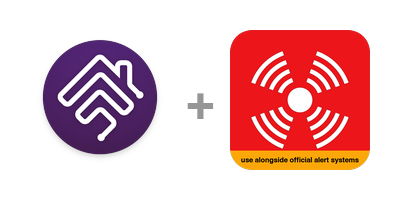

<p align="center">
  <a href="https://github.com/toharush/homebridge-redalert">
    
  </a>
</p>

<h1 align="center">@toharush/homebridge-redalert</h1>

<p align="center">
  <strong>Homebridge plugin for Israeli Red Alert (Pikud HaOref) notifications via HomeKit motion sensors.</strong>
  <br><br>
  <a href="https://www.npmjs.com/package/@toharush/homebridge-redalert"></a>
  <a href="https://www.npmjs.com/package/@toharush/homebridge-redalert"></a>
  <a href="https://www.npmjs.com/package/@toharush/homebridge-redalert"></a>
  <a href="https://github.com/toharush/homebridge-redalert/blob/main/LICENSE"></a>
  <br>
  <a href="https://github.com/homebridge/homebridge/wiki/Verified-Plugins"></a>
  
  
  
  <a href="https://github.com/toharush/homebridge-redalert/graphs/contributors"></a>
  <a href="https://github.com/toharush/homebridge-redalert"></a>
</p>

<p align="center">
  Polls the official Pikud HaOref API directly — no Telegram, no middleman, no authentication required.
</p>

---

## How It Works

1. The plugin creates one **motion sensor** per configured sensor in HomeKit.
2. A single poller fetches the Pikud HaOref API every second (configurable) — adding sensors does **not** add API calls.
3. Each sensor independently filters alerts by its own cities and categories.
4. When an alert matches, the sensor turns **ON**.
5. The sensor stays **ON** until Pikud HaOref sends an "Event Ended" message for your city.
6. If "Event Ended" is never received, the alert auto-clears after the configured timeout (default: 30 min).
7. Create HomeKit automations based on each motion sensor (e.g. flash lights, play a sound, send a notification).

---

## Installation

Search for `redalert` in the Homebridge plugin search, or install manually:

```bash
npm install -g @toharush/homebridge-redalert
```

[](https://www.npmjs.com/package/@toharush/homebridge-redalert)

---

## Configuration

Configure via the Homebridge UI with the built-in **searchable city selector**, or manually in `config.json`:

```json
{
  "platform": "RedAlert",
  "sensors": [
    {
      "name": "Home",
      "cities": ["תל אביב - יפו", "חיפה"],
      "categories": ["rockets", "uav", "earthquake", "terror"],
      "prefix_matching": false
    }
  ],
  "turnoff_delay": 0,
  "alert_timeout": 1800000,
  "polling_interval": 1000,
  "debug": false
}
```

> **Migration note:** Upgrading from v1.3.2 or earlier? Your comma-separated `cities` strings will be automatically migrated to the new array format on first launch. No action needed.

### Multi-Sensor Example

Each sensor creates a separate motion sensor in HomeKit with its own cities, categories, and prefix matching:

```json
{
  "platform": "RedAlert",
  "sensors": [
    { "name": "Home", "cities": ["תל אביב - יפו"], "categories": ["rockets", "uav"] },
    { "name": "Office", "cities": ["חיפה"], "prefix_matching": true },
    { "name": "Parents", "cities": ["באר שבע"], "categories": ["rockets"] }
  ]
}
```

---

## Options Reference

### Sensor Options

| Option | Required | Default | Description |
|--------|----------|---------|-------------|
| `name` | Yes | — | Unique sensor name (appears in HomeKit) |
| `cities` | Yes | — | Array of city names in Hebrew. Select from the built-in list or type custom names |
| `categories` | No | All | Alert types to monitor. If empty, all categories are enabled |
| `prefix_matching` | No | `false` | City names match by prefix (e.g. "תל אביב" matches all Tel Aviv sub-areas) |

### Advanced Options

Global settings available under the **Advanced** section in the Homebridge UI.

| Option | Default | Description |
|--------|---------|-------------|
| `turnoff_delay` | `0` | Delay (ms) before turning off after alert ends. Resets if a new alert arrives (0–3,600,000) |
| `alert_timeout` | `1800000` | Auto-clear alerts (ms) if "Event Ended" is never received. Default: 30 min (600,000–3,600,000) |
| `polling_interval` | `1000` | How often to poll the API in ms (500–5,000) |
| `request_timeout` | `3000` | API response timeout in ms. Increase for slow networks (1,000–10,000) |
| `debug` | `false` | Enable extra debug logging |

### Available Categories

| Key | Description |
|-----|-------------|
| `rockets` | Rockets & Missiles (ירי רקטות וטילים) |
| `uav` | UAV Intrusion (חדירת כלי טיס) |
| `nonconventional` | Non-conventional Threat |
| `warning` | Heads-up Notice (התרעה מוקדמת) |
| `earthquake` | Earthquake (רעידת אדמה) |
| `cbrne` | Chemical / Bio / Nuclear |
| `terror` | Terrorist Infiltration (חדירת מחבלים) |
| `tsunami` | Tsunami (צונאמי) |
| `hazmat` | Hazardous Materials (חומרים מסוכנים) |

---

## Documentation

For detailed docs, architecture, automation examples, and troubleshooting, see the [Wiki](https://github.com/toharush/homebridge-redalert/wiki).

---

## Disclaimer

**חשוב מאוד לקרוא!**

התוסף איננו תוסף רשמי של פיקוד העורף או מערכת הבטחון.
התוסף משתמש ב-API של פיקוד העורף לקבלת התרעות ולכן יתכנו שיבושים.
בכל מקרה יש להמשיך להשתמש באמצעיים הרשמיים של מערכת הבטחון.

1. This plugin is **not** an official Home Front Command product.
2. The plugin uses the Pikud HaOref public API. There may be delays or disruptions.
3. **Always** use the official alert systems alongside this plugin.

---

## License

MIT
